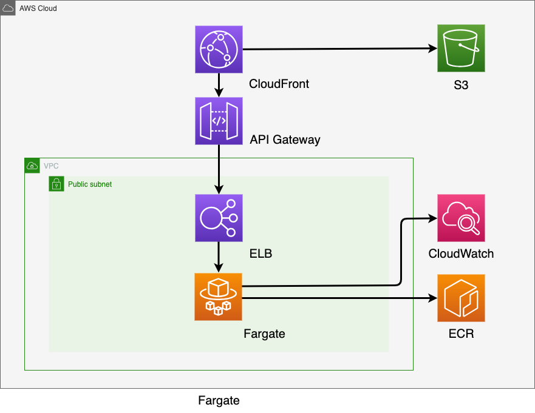
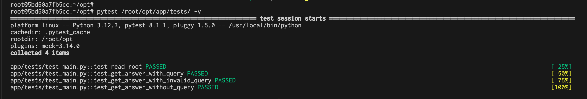

# 自然言語処理(Sentence-BERT)を使った高信頼性AIチャットボット

<p align="center">
  
</p>


[](https://www.python.org/)


[](https://docs.docker.com/compose/)
[](https://pytest.org/)
[](https://jquery.com/)
[](https://getbootstrap.com/)


従来のチャットボットでは誤回答のリスクがありましたが、今回開発したAIチャットボットは、最初から質問と答えを用意することで、高信頼性を実現しました。これは、Sentence BERTを使い、質問と回答に対して類似文章検索を行っています。

# インフラ構成

<p align="center">
  
</p>

+ Amazon S3 (Simple Storage Service): オブジェクトストレージサービス。静的コンテンツ、アプリケーションデータ、バックアップデータなどを保存するために使用します。
+ Amazon API Gateway: RESTful API を構築、デプロイ、管理するためのサービス。API クライアントからのリクエストを処理し、バックエンドサービスにルーティングします。
+ Amazon CloudWatch: モニタリングおよびログ収集サービス。インフラ、アプリケーション、およびログを監視するために使用します。
+ Amazon CloudFront: コンテンツ配信ネットワーク (CDN)。静的コンテンツを世界中のユーザーに低遅延で配信するために使用します。
+ Amazon Elastic Load Balancing (ELB): トラフィックを複数のロードバランサーに分散させるサービス。アプリケーションの可用性とスケーラビリティを向上させるために使用します。
+ Amazon Fargate: コンテナーサービス。サーバーをプロビジョニングおよび管理することなく、コンテナーをデプロイおよび実行するために使用します。
+ Amazon Elastic Container Registry (ECR): コンテナーイメージを保存および管理するためのプライベートレジストリサービス。

# システム構成
+ FastAPI: Python製の高性能Webフレームワーク。
+ Nuxt.js: Vue.js製のユニバーサルアプリケーションフレームワーク。

# 起動とデプロイ方法
1. 以下のコードを実行してWebサーバーをビルドします。
```
bin/webserver_build
```

2. 以下のコードを実行してインフラを構築し、APIサーバーをデプロイします。
```
bin/terraform_apply
```

3. webserver/app/.output/publicのアップロード
    1. ローカル環境で webserver/app/.output/publicディレクトリを開きます。
    2. S3 バケットに webserver/app/.output/publicディレクトリ配下のファイルをアップロードします。

4. CloudFrontからドメイン名を取得
    1. AWS マネジメントコンソールで Amazon CloudFrontサービスに移動します。
    2. ディストリビューション一覧から、目的のディストリビューションを選択します。
    3. ディストリビューション画面が表示されたら、 ディストリビューションドメイン名をコピーします。
5. URLにアクセス
    1. ブラウザを開き、先ほどコピーしたURLにアクセスします。

# 停止
以下のコードを実行すると停止できます。
```
bin/terraform_destroy
```

# テスト項目
+ GETメソッドによるルートエンドポイントの正常処理検証テスト
+ POSTメソッドによる正常処理テスト (クエリパラメータあり)
+ クエリに不正な値が渡された場合の挙動検証テストケース
+ クエリが省略された場合の挙動検証テストケース

# テスト結果

<p align="center">
  
</p>


